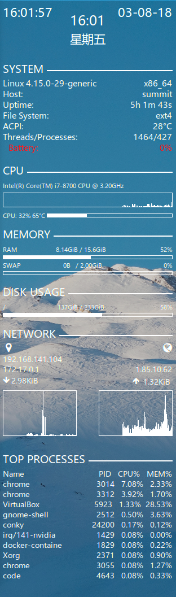

# conky 主题

## 安装conky

```shell
$ sudo apt install conky-all
```

## 运行

```shell
$ conky
```

## copy conky.conf

```shell
$ sudo cp /etc/conky/conky.conf ~/.config/conky/conky.conf
```

## 修改conky.conf

选择下面列表中的某一个主题，将其配置内容拷贝到上面~/.config/conky/conky.conf中

## 列表

* 

  [conky.conf](./conf/1/conky.conf)
